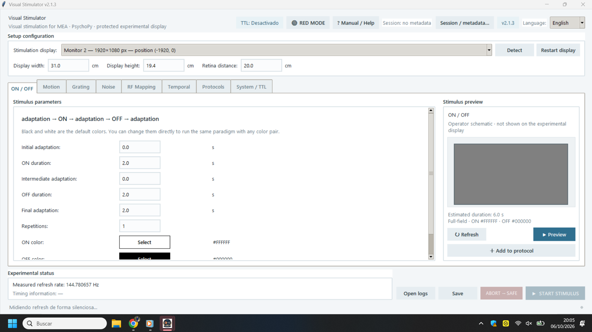
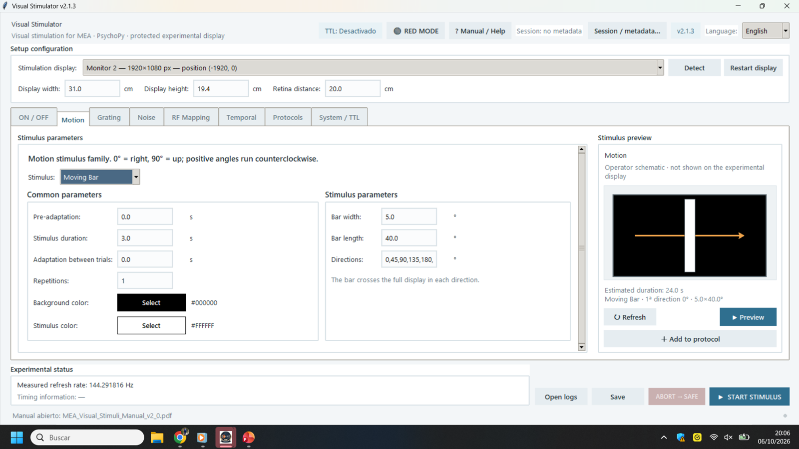
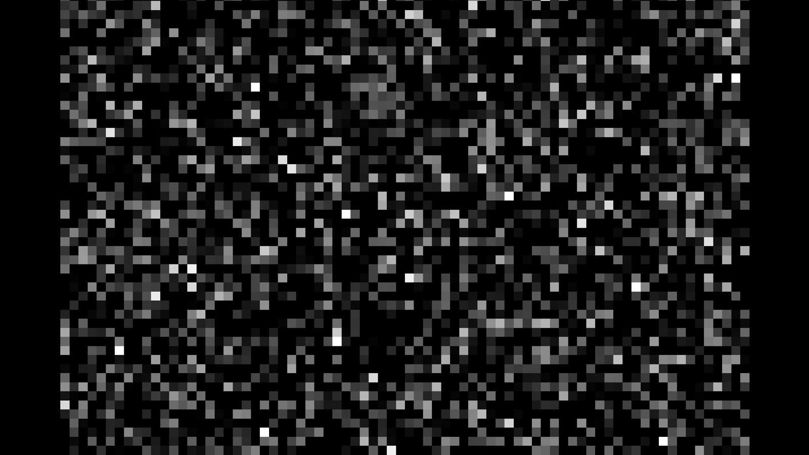
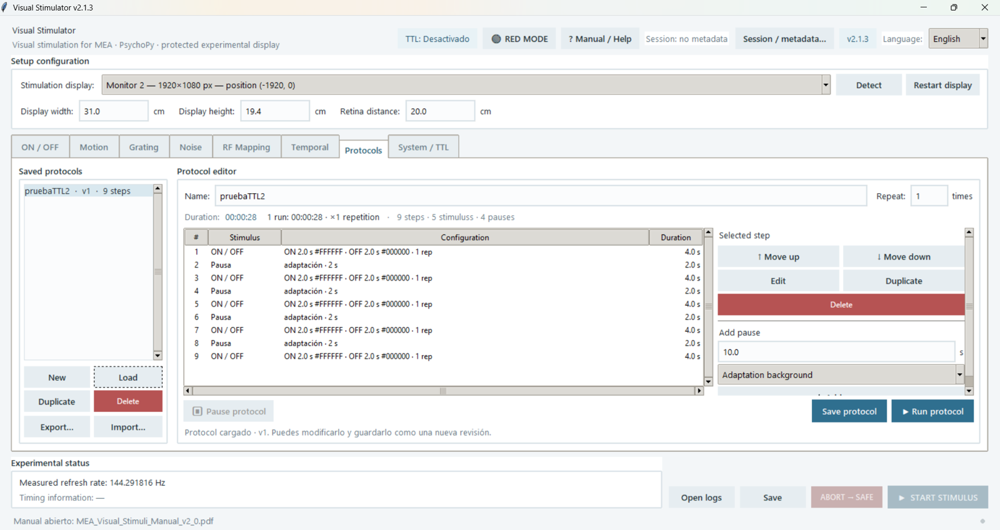
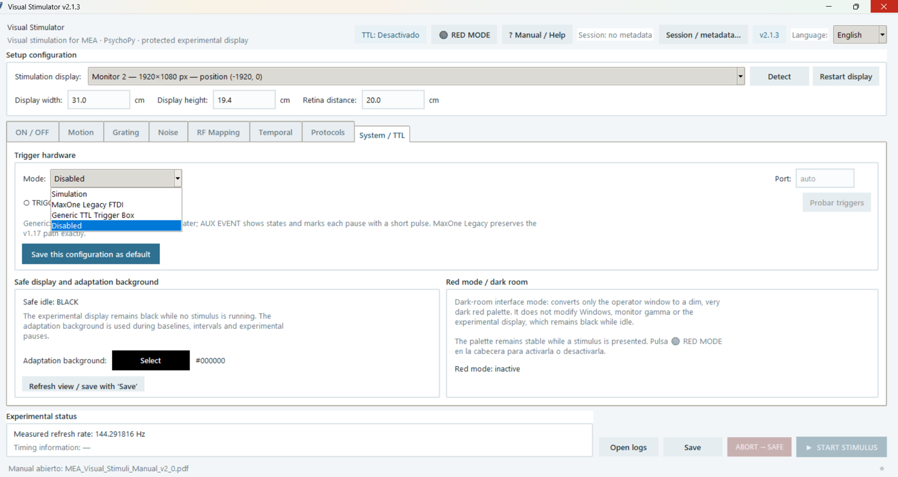
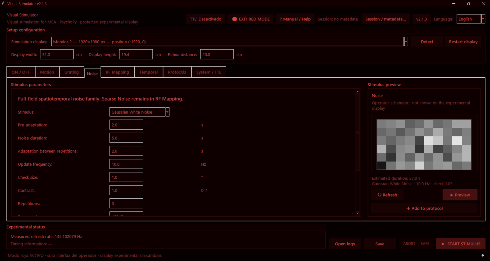

# Visual Stimulator

**Open scientific software for controlled visual stimulation in experimental research.**

Current release: **v2.1.3**

**Visual Stimulator** is a Windows-oriented experimental tool for presenting controlled and reproducible visual stimuli on a dedicated stimulation display while the operator works from a separate interface. It is designed around reproducibility, explicit timing records, protocol construction, and optional synchronization with external acquisition systems.

The program is **not restricted to MEA experiments**. It is intended as a general-purpose visual-stimulation platform for any experimental setup in which controlled display-based stimulation is appropriate, including:

- multi-electrode array (MEA) and other electrophysiology experiments;
- ex vivo retinal, cellular or tissue preparations;
- in vivo visual experiments;
- experiments synchronized with PowerLab, MEA systems or other acquisition hardware;
- standalone visual-stimulation paradigms that do not require an external acquisition system.

The current v2.1.x branch preserves the experimental architecture originally developed and validated in an MEA/PowerLab workflow, while broadening the public identity and intended scope of the software. The bundled v2.0 manual and some internal compatibility identifiers retain the earlier **MEA Visual Stimuli** name for traceability with the validated development branch; the current project name is **Visual Stimulator**.

The v2.1.x branch also provides a bilingual Spanish/English operator interface. English is the default language for new installations.

## Screenshots

### Operator interface



### Motion stimuli




### Noise stimuli



### Protocol builder



### System / TTL



### Red operator-interface mode



## Main capabilities

- Dedicated PsychoPy presentation worker for the experimental monitor.
- Physical display geometry expressed through screen dimensions and retina/experimental-plane distance.
- Stimulus families including:
  - ON / OFF
  - Moving Bar and Moving Spot
  - Looming, Receding, and annular motion
  - Drifting, Static and Phase-Reversal gratings
  - Static and Drifting Gabors
  - Asymmetric Drift
  - dense, Gaussian and frozen noise
  - receptive-field mapping and Sparse Noise
  - temporal stimuli including Chirp, sinusoidal/gaussian flicker, and contrast series
- Reproducible multi-step protocols with configurable pauses.
- Optional session metadata.
- Per-run logging of frame timing, TTL events, and executed configuration.
- Measured display refresh based on real `win.flip()` intervals rather than relying only on nominal monitor values.
- Detection/reporting of timing irregularities through `possible_dropped_frame`.
- Optional TTL operation: simulation, MaxOne Legacy FTDI, generic FTDI-based TTL trigger box, or disabled mode.
- UNIVERSAL frame/event synchronization and AUX EVENT state track in the validated generic TTL workflow.
- Safe abort/return-to-black behavior.
- Dark red operator-interface mode for low-light experimental environments.
- Spanish and English operator interface.

## Download and installation

For normal use, download the Windows installer from the **[latest GitHub Release](https://github.com/SantiMillaNavarro/Visual-Stimulator/releases/latest)**.

The standalone installer is intended to run without requiring Jupyter, Anaconda, VS Code, or a separate manual Python installation.

### Current release

**v2.1.3 — Windows 10 x64 installer**

Release asset:

`Visual_Stimulator_v2_1_3_Setup_Win10_x64.exe`

SHA-256:

```text
bf733439e707f5ba65884fb50928b5024e286c601cbe646adbaba2317fd67f2f
```

The current installer is **not digitally code-signed**, so Windows SmartScreen may display a warning on first launch. Verify the SHA-256 above if you want to confirm that the downloaded installer matches the published v2.1.3 build.

See [`RELEASE_NOTES_v2.1.3.md`](RELEASE_NOTES_v2.1.3.md) for the release summary.

## Documentation

The technical/user manual is available here:

[`docs/MEA_Visual_Stimuli_Manual_v2_0.pdf`](docs/MEA_Visual_Stimuli_Manual_v2_0.pdf)

The v2.0 manual documents the validated experimental architecture used by the v2.1.x branch. The later 2.1.x releases primarily extend the bilingual interface and presentation-layer coverage while retaining internal stimulus/protocol identifiers for compatibility.

See [`CHANGELOG.md`](CHANGELOG.md) for the subsequent maintenance history.

## Source code

The source is provided in two equivalent forms:

- [`src/Visual_Stimulator_v2_1_3.py`](src/Visual_Stimulator_v2_1_3.py) — easier to inspect, search and diff on GitHub.
- [`src/Visual_Stimulator_v2_1_3.ipynb`](src/Visual_Stimulator_v2_1_3.ipynb) — Jupyter notebook retained for development continuity.

The application uses Python/Tkinter for the operator interface and PsychoPy for experimental visual presentation. The source environment also requires NumPy and Pyglet; PySerial is used by FTDI-based trigger modes.

Exact package versions for the v2.1.3 development environment are not currently pinned in the repository. For experimental use, the packaged Windows release is therefore the recommended distribution. Developers running from source should validate display timing and hardware behavior on their own setup.

## Experimental records and reproducibility

Each execution can generate records describing the executed configuration and optional session metadata, per-frame timing, TTL events/states, and timing/diagnostic results.

For reproducibility, keep these files together with the corresponding acquisition file from the MEA/PowerLab or other recording system.

Application-generated logs and experimental CSV files are intentionally excluded from Git through `.gitignore`.

## Timing and validation

The v2.0 validation documented in the manual was performed on the specific laboratory setup described there. In the reported final test:

- measured display refresh: **60.0285 Hz**;
- a nominal 2 s period corresponded to **120 frames**;
- median interval between onsets: **2.0001 s**;
- total flip duration for a nominal 28 s protocol: approximately **28.041 s**;
- FRAME→EVENT delay: mean **3.239 ms**;
- EVENT width: mean **1.230 ms**;
- AUX pause marker: mean **1.193 ms**.

These measurements demonstrate the behavior of the tested setup; they are **not a guarantee for other hardware or operating environments**.

## Important experimental considerations

Before scientific use on a new setup:

- verify physical display dimensions and viewing/retina distance;
- confirm the measured refresh rate;
- test the intended stimuli and protocols;
- inspect timing diagnostics and `possible_dropped_frame`;
- validate TTL polarity, level, timing and cabling on the actual acquisition hardware;
- verify that AUX EVENT is in the expected LOW state before definitive acquisition when using the documented generic TTL workflow;
- calibrate monitor gamma/luminance when physical luminance or contrast is quantitatively important.

The red interface mode only changes the operator-interface palette; it does not modify the stimulation display, system gamma/LUT, or provide a substitute for controlled scotopic illumination.

## Tested acquisition workflow

The v2.0 manual documents validation with a **PowerLab 4/20T** and **LabChart**, using the generic TTL trigger-box workflow.

That hardware combination is a documented validation case, not a requirement for using the software.

## Version history

See [`CHANGELOG.md`](CHANGELOG.md).

## Contributing

Contributions, bug reports and scientifically useful improvements are welcome. Please see [`CONTRIBUTING.md`](CONTRIBUTING.md).

Changes that affect stimulus generation, display timing, TTL behavior or protocol compatibility should include enough information to understand how they were tested. The aim is to keep Visual Stimulator free, reproducible and useful across different experimental setups.

## Artificial-intelligence-assisted development

This project has been developed with significant assistance from artificial-intelligence tools.

The application code has been generated and modified iteratively with **ChatGPT by OpenAI**, based on specifications, experimental requirements, design decisions, testing, validation observations, and requested corrections provided by **Santi Milla Navarro**.

Santi Milla Navarro has directed the functional development of the project: defining objectives and experimental behavior, testing successive versions on real hardware, identifying errors, validating experimental workflows, and specifying the required corrections and improvements. ChatGPT has acted as a development tool for code generation/modification, documentation, review, and repository organization.

This statement is included to provide transparency about the development process.

## Author

© 2026 Santi Milla Navarro

Project directed by **Santi Milla Navarro**.

## Citation

If **Visual Stimulator** contributes to your research, please cite the software and the version used. GitHub can generate citation information directly from [`CITATION.cff`](CITATION.cff).

A persistent DOI can be added in the future if the project is archived through a service such as Zenodo.

## License

Copyright © 2026 Santi Milla Navarro.

**Visual Stimulator is free software licensed under the GNU General Public License v3.0 or later (GPL-3.0-or-later).**

You are free to use, study, modify and redistribute the software under the terms of that license. If you distribute a modified version, the corresponding source and the same GPL freedoms must remain available to its recipients.

The license is intended to keep the project free and open as it evolves, while allowing researchers to use and adapt it without licensing fees.

See [`LICENSE`](LICENSE) for the complete terms.
